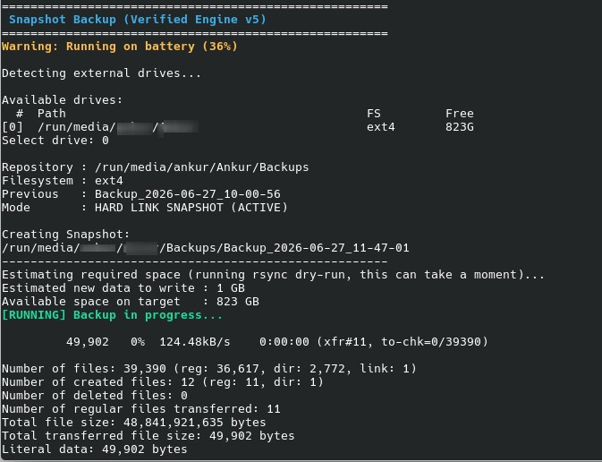

# Snapshot Backup (Verified Engine v5)

A lightweight, hardened snapshot-based backup system for Linux, built on `rsync` and hard links.

Each backup appears as a complete, independent copy of your files, while unchanged files are shared between snapshots using hard links. This gives you Time Machine–style versioned backups without duplicating unchanged data on disk.

Built and tested on KDE Plasma / udisks2 automount setups, with fallback support for other Linux desktop environments.

---

## Table of Contents

- [Quick Start](#quick-start)
- [Features](#features)
- [Requirements](#requirements)
- [Filesystem Support](#filesystem-support)
- [How It Works](#how-it-works)
- [Usage](#usage)
- [Restoring Files](#restoring-files)
- [Snapshot Verification](#snapshot-verification)
- [Configuration](#configuration)
- [.backupignore Support](#backupignore-support)
- [Retention](#retention)
- [Security & Privacy](#security--privacy)
- [Known Limitations](#known-limitations)
- [Example Output](#example-output)
- [Design Philosophy](#design-philosophy)
- [License](#license)
- [Disclaimer](#disclaimer)

---

## Quick Start

```bash
git clone https://github.com/UFpondiboy/linux-snapshot-backup.git
cd linux-snapshot-backup
chmod +x snapshot-backup.sh
mkdir -p ~/.local/bin
cp snapshot-backup.sh ~/.local/bin/
```

Make sure `~/.local/bin` is on your `PATH` (most modern distros already add it automatically for interactive shells). If it isn't, add this to your `~/.bashrc`:

```bash
export PATH="$HOME/.local/bin:$PATH"
```

Then run it:

```bash
snapshot-backup.sh
```

The script will detect connected external drives, let you pick one, and create a snapshot. To preview what a backup *would* do without writing anything to disk:

```bash
snapshot-backup.sh --dry-run
```

---

## Features

- Snapshot-based backups using `rsync --link-dest`
- Hard-link deduplication — unchanged files cost zero extra disk space
- Incremental storage growth — only new/changed data is written
- Restore by simple file copy — no special tooling required
- Per-snapshot SHA-256 integrity manifests
- **Incremental manifest generation** — unchanged files inherit their checksum from the previous snapshot instead of being re-hashed every run
- Automatic retention policy (count-based, safely guarded)
- External drive auto-detection (`/run/media/$USER`, `/media/$USER`, `/media`)
- Source/destination overlap protection
- Concurrent-run protection via file locking
- Optional per-folder `.backupignore`
- Post-backup sanity check (random sample vs. live source)
- Dry-run mode
- Desktop notifications on success/failure
- Detailed per-run logging

---

## Requirements

**Required:**
- Linux
- Bash 4+
- rsync
- coreutils
- findutils

**Optional (script degrades gracefully if missing):**
- `notify-send` — desktop notifications
- `upower` — battery status warning
- `shuf` — required for the sanity check step

---

## Filesystem Support

**Recommended (destination drive):**
- ext4
- xfs
- btrfs

**Not recommended for snapshot mode:**
- exFAT
- vFAT
- NTFS

These filesystems do not reliably support hard links. Using one as your backup destination will cause every snapshot to become a full, non-deduplicated copy rather than a space-efficient incremental one. The script detects this and warns you before proceeding.

---

## How It Works

### First Backup

The first run creates a complete baseline snapshot:
Backups/

└── Backup_2026-06-27_10-00-56/

### Subsequent Backups

Later runs use `rsync --link-dest=<previous_snapshot>`:

- Unchanged files are hard-linked to the previous snapshot (zero extra disk space)
- Changed or new files are copied normally

Backups/

├── Backup_2026-06-27_10-00-56/

├── Backup_2026-06-28_10-00-22/

└── Backup_2026-06-29_10-00-11/

Each snapshot looks and browses like a complete, independent backup — but unchanged files physically occupy disk space only once.

---

## Usage

Run interactively:

```bash
snapshot-backup.sh
```

Preview a run without writing anything:

```bash
snapshot-backup.sh --dry-run
```

The script will:
1. Detect available external drives and show a table of path / filesystem / free space
2. Let you select a target drive
3. Check filesystem hard-link support
4. Estimate required space via an actual `rsync --dry-run` (not a naive folder-size guess)
5. Run the backup, then verify it — hard-link check, deletion report, random sanity check, and incremental manifest build
6. Apply retention automatically

---

## Restoring Files

No special restore process exists — that's intentional. Browse to the desired snapshot with any file manager (Dolphin, Nautilus, Thunar) or the command line:

Backups/

└── Backup_2026-06-27_10-00-56/

Copy files back with `cp` or `rsync`:

```bash
cp Backup_2026-06-27_10-00-56/Documents/report.pdf ~/Documents/
```

Entire folders can be restored the same way.

---

## Snapshot Verification

Every completed snapshot contains `.snapshot_manifest.sha256`. To verify a snapshot at any point in the future — confirming the data hasn't been corrupted or bit-rotted since it was created:

```bash
cd Backup_2026-06-27_10-00-56
sha256sum --check .snapshot_manifest.sha256
```

A successful verification reports every file as `OK` with no `FAILED` entries:
./Documents/report.pdf: OK
./Pictures/photo.jpg: OK

For a quiet pass/fail check instead of per-file output:

```bash
sha256sum --check --quiet .snapshot_manifest.sha256 && echo "All files verified OK"
```

This check reads the snapshot data directly off the backup drive — it verifies the backup itself, independent of your live system. Even if your primary drive fails entirely, a verified snapshot has already proven itself intact on its own.

---

## Configuration

Optional custom source list:
~/.config/snapshot-backup/sources.conf

One path per line:
~/Documents
~/Pictures
~/Videos

Blank lines and lines starting with `#` are ignored. A leading `~` expands to `$HOME`. If no config file exists, the script uses its built-in default source list (Desktop, Documents, Downloads, Pictures, Videos).

---

## .backupignore Support

Place a `.backupignore` file inside any source directory to exclude patterns from that folder only:
*.tmp
*.bak
cache/

Rules apply only to that directory subtree. Implemented using rsync's native per-directory merge filter (`--filter=': .backupignore'`), so path handling is done correctly by rsync itself rather than hand-built exclude logic.

---

## Retention

Snapshots are retained automatically.

- **Default:** keeps the most recent 50 completed snapshots
- Older snapshots beyond that count are removed automatically
- Incomplete snapshots from an interrupted run are cleaned up automatically on the next run
- Every deletion is guarded by a strict filename-pattern check (`^Backup_YYYY-MM-DD_HH-MM-SS$`) before anything is removed — this script will never `rm -rf` a directory whose name doesn't match the exact expected snapshot format

---

## Security & Privacy

This software operates entirely on local storage selected by the user. It does not:

- Upload data to cloud services
- Transmit data over any network
- Collect telemetry
- Require internet access or user accounts

Integrity verification is performed using per-snapshot SHA-256 manifests, generated and stored entirely locally. All backup data remains under your control at all times.

---

## Known Limitations

**Renamed files** — Renaming a file causes it to be treated as a deletion (old path) plus a new file (new path), and rehashed during manifest generation rather than recognized as the same file. This does not affect correctness or data safety, only efficiency in that specific case.

**Manifest sorting** — Manifest generation sorts the full file list on every run. At typical personal-backup file counts (tens of thousands of files) this overhead is negligible; it may become noticeable well beyond that scale.

**Timestamp resolution** — Manifest inheritance relies on inode + size + modification time (second resolution). A file rewritten multiple times within the same second, ending at the same size, could theoretically inherit a stale checksum. Extremely unlikely in practice on modern Linux filesystems, and has not been observed in testing.

---

## Example Output

A typical incremental run, showing hard-link verification, deletion tracking, sanity check, and incremental manifest inheritance in action:
======================================================
Snapshot Backup (Verified Engine v5)
Detecting external drives...
Available drives:
Path  FS Free
[0]  /run/media/user/BackupDrive ext4 822G
Select drive: 0
Repository : /run/media/user/BackupDrive/Backups
Filesystem : ext4
Previous   : Backup_2026-07-02_09-36-03
Mode       : HARD LINK SNAPSHOT (ACTIVE)
Creating Snapshot:
/run/media/user/BackupDrive/Backups/Backup_2026-07-03_09-45-24
Estimating required space (running rsync dry-run, this can take a moment)...
Estimated new data to write : 3 GB
Available space on target   : 822 GB
[RUNNING] Backup in progress...
======================================================
Snapshot Summary
Base snapshot : Backup_2026-07-02_09-36-03
Snapshot created  : Backup_2026-07-03_09-45-24
Files transferred : 11
New data written  : 2,194,552,464 bytes
rsync duration    : 31 sec
No per-file errors detected.
Verifying hard links against previous snapshot...
Linked specifically to previous snapshot : 36692 / 36704 files
Checking for files removed since previous snapshot...
No files removed since previous snapshot.
Running sanity check (20 random files, not exhaustive)...
Sanity check passed: 20 sampled files match the source.
Building snapshot manifest (incremental)...
Manifest written: 36704 file(s) total (36691 inherited, 13 hashed).
To verify later: cd .../Backup_2026-07-03_09-45-24 && sha256sum --check .snapshot_manifest.sha256
======================================================
Backup Completed Successfully
======================================================
Retention
Completed snapshots on drive : 14 (keeping last 50)
Nothing to remove.
Quick integrity signal:
Apparent snapshot size (includes hard-linked data): 44G
Total script duration : 71 sec

Out of 36,704 files, 36,691 checksums were inherited from the previous snapshot's manifest — only 13 files needed to be freshly hashed. That's the incremental manifest doing its job: full integrity coverage without re-reading the entire dataset on every run.

## Example Screenshots

Incremental backup:




---

## Design Philosophy

**Simple restore beats clever restore.**

Every snapshot is an ordinary directory of ordinary files — directly browsable and restorable with any file manager or `cp`. This project intentionally avoids:

- Databases
- Proprietary backup formats
- Catalog files
- Background daemons
- Network services
- Dedicated restore utilities

If this script disappears tomorrow, every backup it created remains fully accessible through standard filesystem tools. The primary goal is long-term recoverability, not feature complexity.

---

## License

This project is licensed under the MIT License. See the [LICENSE](LICENSE) file for details.

If you redistribute or modify this project, please retain the original copyright notice and license text as required by the license. Forks, improvements, bug fixes, and derivative works are welcome — credit to the original project is appreciated.

---

## Disclaimer

This software has been tested on personal Linux systems and is provided as-is, without warranty. The author is not responsible for data loss, corruption, or damage resulting from its use.

**Always test restores before relying on any backup solution.** And always follow the golden rule of backups: if your data exists in only one place, it is not backed up — maintain at least one additional copy of anything important.

Use at your own risk.
